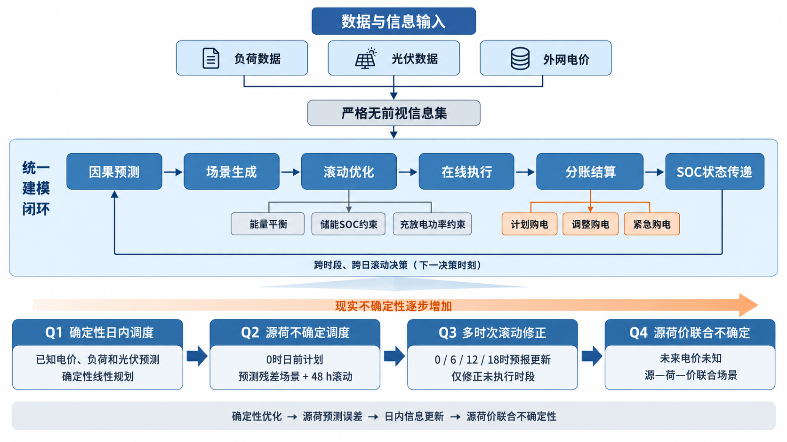

# 二、问题分析

## 2.1 问题一分析

问题一是在负载、电价和光伏预测均已知条件下制定单日计划购电策略，属于确定信息下的连续调度问题。其核心不是对各时段分别购电，而是在144个10分钟时段之间协调外网购电、光伏利用和储能充放电。储能在低价或光伏富余时吸收电量，在高价时释放电量，因此前一时段的充放电动作会通过储电量影响后续决策，必须统一描述逐格能量平衡、储能状态转移、充放电功率限制和首末储电量一致条件。

本问的购电费用、能量平衡和储能约束均可写成线性形式，决策变量又均为连续量，因此适合建立确定性线性规划模型。为判断储能是否真正带来经济价值，需要设置无储能直接购电方案作为基线；同时还要防止连续线性规划出现同时充放电或无意义弃用等退化动作。由此，本问应先求购电费用最小解，再在不改变最优费用的条件下压缩充放电吞吐量和弃用量，并通过能量平衡残差、储能状态残差及首末SOC检查模型的物理可行性。

## 2.2 问题二分析

问题二在问题一的物理模型上引入全年变化的负载和光伏出力。每天0时制定计划时，当天实测源荷尚不可见，而计划不足形成的供电缺口需要按五倍电价紧急购入，因此本问的难点是把预测误差转化为可以度量和控制的购电风险。若直接使用当日实测数据制定计划，会产生前视偏差；若只使用单条点预测，又难以描述局部低估对紧急购电的影响。

为保证策略可执行，应按照时间顺序使用历史数据，对负载和光伏分别进行无前视预测，再从历史预测残差中构造多种可能的源荷场景。在每个场景中，日前计划保持一致，储能运行和紧急购电作为实际情况出现后的补救变量，从而形成两阶段场景规划结构。由于储能状态跨日连续，若优化范围只覆盖当天，模型可能在日末过度放电，因此采用48小时滚动时域估计次日储能价值，但只执行首个24小时的计划。模型选择还需结合朴素预测基线、完美信息下界、场景数收敛和候选风险权重检验，避免把预测精度或模型复杂度直接等同于实际调度效果。

## 2.3 问题三分析

问题三在问题二的日前计划基础上增加0、6、12、18时光伏预报。新信息能够缩小后续时段的光伏偏差，但调整购电量需要承担上调费用或下调违约费用，因此不能仅以预报更接近实测为由认定调整必然有利。本问的关键是明确每次预报的可用时刻，并保证新预报只改变尚未执行的时段，已经完成的购电和储能动作不得回溯修改。

据此，可将一天划分为由四次预报驱动的连续决策阶段：0时形成初始计划，6、12、18时根据新预报和当前SOC重新计算剩余时段的有效购电量。计划购电、上调、下调和紧急购电具有不同计费规则，需要在同一目标函数中分别核算，并利用辅助变量表达购电调整的正负差额。为回答“是否需要引入其他时刻预报”，还应依次比较仅使用0时预报、加入6时、再加入12时和再加入18时的策略，联合考察总费用与紧急购电风险，而不能只比较某一个典型日或单一指标。

## 2.4 问题四分析

问题四进一步把固定日内电价扩展为实时波动电价。此时负载、光伏和价格均具有不确定性，购电时段的选择既取决于净负荷缺口，也取决于未来高低价分布。若将附件4中的未来实际电价直接用于计划制定，同样会产生信息穿越，因此必须把未来价格视为未知量，只能利用决策时刻以前的价格历史进行预测，并在新价格实现后更新后续判断。

本问应在问题二和问题三的同一框架内分别重算日前计划策略与多时次修正策略，而不是另建一套无法比较的模型。为保留净负荷高低与电价波动之间可能存在的同步关系，可将源、荷、价预测残差按相同历史日期联合抽样，构造源—荷—价场景；同时用独立抽样作为相关性敏感性对照。两种策略必须使用相同的波动电价信息边界和结算规则，再从总费用、紧急购电、尾部费用和储能动作等方面比较，才能判断滚动修正在价格不确定条件下的作用。

## 2.5 总体分析思路

四个问题并非彼此独立，而是在同一能量平衡、储能状态和购电结算框架上逐层增加现实约束：问题一建立确定信息下的物理与费用基线；问题二引入源荷预测误差和跨日状态传递；问题三利用多时次预报修正未执行计划；问题四再加入未来电价不确定性。由此，全文形成“确定性日内优化—无前视场景滚动—多阶段计划修正—源荷价协同调度”的统一技术路线。

图1 统一技术路线

图1展示了全文统一的信息与决策流程。问题一提供确定性基准，问题二至问题四依次扩展预测对象和计划修正机制，最终从成本、风险与物理可行性三个方面评价调控策略。问题三的0/6/12/18时滚动修正细节见后文机制图。
