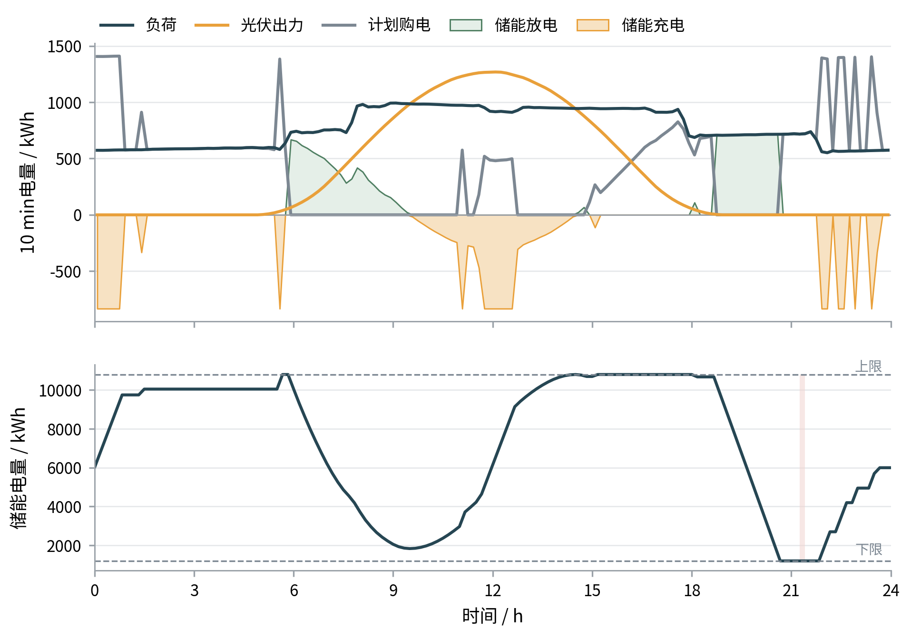
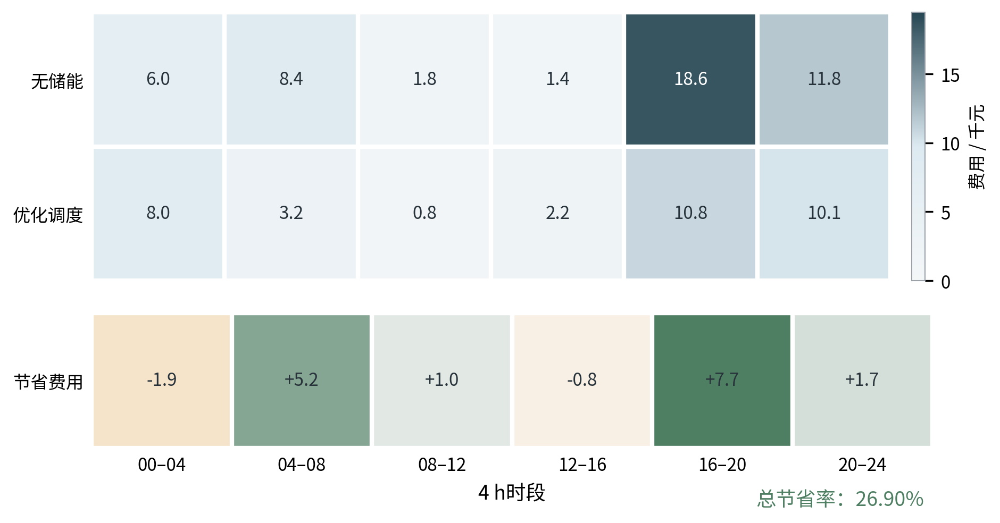

# 五、模型建立与求解

## 5.1 问题一模型的建立与求解

问题一是在全天电价、负载和光伏预测均已知的条件下，于0时确定144个10 min时段的计划购电量和储能充放电量。其核心是利用储能转移电能：在电价较低或光伏富余时充电，在电价较高时放电，并保证微网供能不低于负载、储能运行不越界且0时与24时储电量相同。本问建立的能量平衡、储能状态和购电费用口径，也构成后续问题的基础。

### 5.1.1 能量平衡与储能运行模型

令第 $t$ 格负载和光伏功率分别为 $L_t$、$P_t$，按 $\Delta t=1/6\ \mathrm h$ 折算为

$$
\ell_t=L_t\Delta t,\qquad p_t=P_t\Delta t.
$$

决策变量包括计划购电量 $G_t^0$、充放电量 $C_t,D_t$、储电量 $S_t$、实际利用光伏量 $R_t$、弃光量 $W_t^{pv}$ 和未使用计划电量 $W_t^g$。模型以母线能量平衡和光伏分配保证供需一致，以SOC递推描述储能状态，并满足容量、功率、非负和首末SOC闭合约束。由于全天信息已知且外网购电能力未设上限，本问不设置紧急购电。

以全天计划购电费用最小为目标：

$$
\min J_1=\sum_{t=1}^{144}\pi_tG_t^0.
$$

全部物理关系集中列于5.1.2。目标函数和约束均为线性连续形式，因此问题一属于确定性线性规划。为评价储能收益，设置无储能基线

$$
G_t^{\mathrm{base}}=\max(\ell_t-p_t,0),\qquad
J_{\mathrm{base}}=\sum_{t=1}^{144}\pi_tG_t^{\mathrm{base}},
$$

该基线仅允许光伏直接供给当期负载，不具备跨时段转移能力。

### 5.1.2 问题一模型总括

将上述目标函数、决策变量和约束集中后，问题一可写为

**目标函数**

$$
\min_{\{G_t^0,C_t,D_t,R_t,W_t^{pv},W_t^g,S_t\}}
J_1=\sum_{t=1}^{144}\pi_tG_t^0.
$$

**能量平衡约束**

$$
G_t^0+D_t+R_t=\ell_t+C_t+W_t^g,\qquad
R_t+W_t^{pv}=p_t,\quad t=1,\ldots,144.
$$

**储能状态约束**

$$
S_{t+1}=S_t+\eta_cC_t-\frac{D_t}{\eta_d},\qquad
S_1=S_{145}=6000,\qquad 1200\le S_t\le10800.
$$

**变量边界**

$$
0\le C_t,D_t\le P^{\max}\Delta t=833.3333,
\qquad G_t^0,R_t,W_t^{pv},W_t^g\ge0,
\qquad \eta_c=\eta_d=0.9.
$$

该总括模型为确定性连续线性规划，首末SOC闭合约束保证储能收益不依赖日末透支。

### 5.1.3 求解过程与调度结果

普通线性规划可能存在多个费用相同的最优解。本文采用两阶段词典序求解：先得到最优费用 $J_1^*$，再在 $J_1\le J_1^*+\varepsilon$、$\varepsilon=10^{-7}\max(1,|J_1^*|)$ 下最小化

$$
\Phi=\sum_{t=1}^{144}
\left[0.6(C_t+D_t)+1.1(W_t^{pv}+W_t^g)\right],
$$

以压缩不必要的能量循环和弃用量。两阶段均使用HiGHS求解，第二阶段不改变最优购电费用。

附件1的指定时段结果见表1。全天计划购电量为 $59482.6907\ \mathrm{kWh}$，购电费用为35126.95元。

表1 指定时段计划购电量及全天汇总

| 时间段 | 购电量/kWh | 时间段 | 购电量/kWh | 时间段 | 购电量/kWh |
|---|---:|---|---:|---|---:|
| 10:00—10:10 | 0.0000 | 12:00—12:10 | 480.4125 | 14:00—14:10 | 0.0000 |
| 16:00—16:10 | 445.4317 | 18:00—18:10 | 531.8941 | 20:00—20:10 | 0.0000 |
| 全天购电量 | 59482.6907 | 全天购电费 | 35126.95 |  |  |

图2展示负载、光伏、购电、储能动作和SOC。储能在低价或光伏富余时充电，在早间及16:00—20:00高价时段放电；SOC始终位于允许范围并在24时回到初值。

图2 问题一购电、光伏与储能调度结果

全天充电量为20740.6224 kWh，向母线放电量为16799.9041 kWh，两者差额反映效率损耗。题目规定的6个4 h区间结果见表2。

表2 指定时段储能充放电量及首末储电量

| 时间段 | 充电量/kWh | 放电量/kWh | 时间段 | 充电量/kWh | 放电量/kWh |
|---|---:|---:|---|---:|---:|
| 0:00—4:00 | 4500.0000 | 0.0000 | 4:00—8:00 | 833.3333 | 6365.8058 |
| 8:00—12:00 | 4787.9206 | 1702.9970 | 12:00—16:00 | 5286.0352 | 91.1014 |
| 16:00—20:00 | 0.0000 | 5780.1319 | 20:00—24:00 | 5333.3333 | 2859.8681 |
| 0时储电量 | 6000.0000 |  | 24时储电量 | 6000.0000 |  |

完整144格计划购电和储能运行结果见 result1.xlsx。

### 5.1.4 经济性分析与模型检验

图3比较无储能基线与优化调度的分时购电费用。优化方案在0:00—4:00和12:00—16:00增加低价购电或充电，以降低高价时段支出，其中16:00—20:00节省7739.51元。

图3 问题一各时段购电费用对比

无储能时购电量为61789.9354 kWh、弃光量为6247.9630 kWh、费用为48052.05元；优化后富余光伏全部利用，购电量降至59482.6907 kWh，费用降至35126.95元，共节省12925.10元，节省率为26.90%。购电量仅下降3.73%，说明收益同时来自光伏消纳和高低价时段间的购电转移。

逐格复算的最大能量平衡残差为 $1.14	imes10^{-13} mathrm{kWh}$，最大SOC残差为 $8.60	imes10^{-13} mathrm{kWh}$，同时充放电时段数为0。效率取0.85和0.95时，费用分别为36603.41元和33767.03元，相对无储能基线仍节省23.83%和29.73%，主结论保持稳定。

综上，储能在满足首末SOC闭合的同时实现了削峰移谷与购电费用降低。
