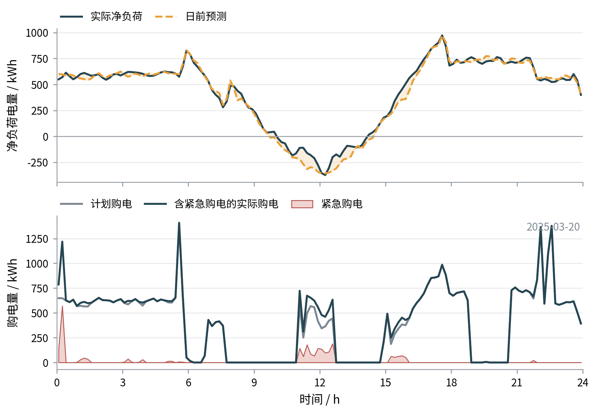
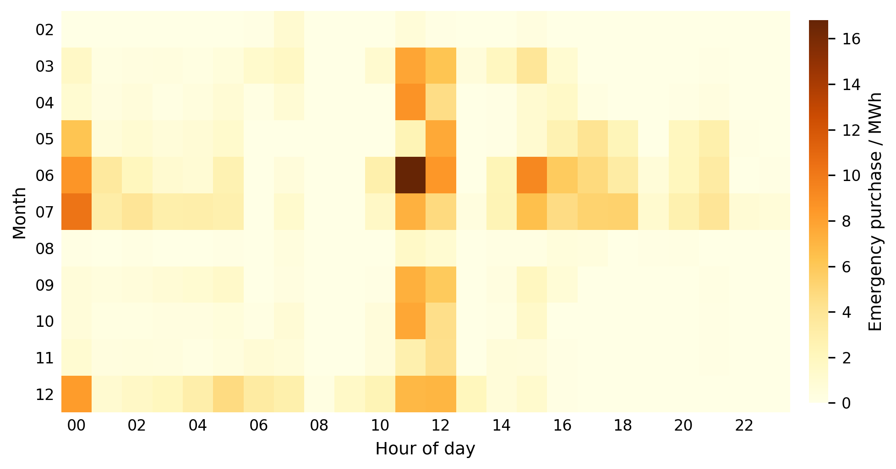

# 五、模型建立与求解

## 5.2 问题二模型的建立与求解

问题二撤去了问题一中“全天源荷完全已知”的条件。每天0时只能利用此前已经获得的历史数据制定全天计划；当实际负载高于可用的计划购电、光伏和储能供电时，缺口须按当期电价的5倍紧急购电。预测不足会造成高额惩罚，预测过量又会形成已付费但未使用的计划电量，因此本问在问题一的能量平衡与储能模型上，引入严格无前视预测、源荷联合场景和跨日滚动优化。

### 5.2.1 严格无前视的源荷预测

设日期 $d$ 的决策时刻为当日0时，$\mathcal I_d$ 表示该时刻之前已经公开或观测到的信息。对未来48 h负载和光伏的点预测分别记为 $\hat\ell_{d,t}$、$\hat p_{d,t}$，并要求

$$
\hat\ell_{d,t}=F_L(\mathcal I_d),\qquad
\hat p_{d,t}=F_P(\mathcal I_d),
$$

即预测模型的训练样本、滞后特征和残差样本均不得包含日期 $d$ 及其以后的实测值。本文以1月逐日扩展窗回测的归一化平均绝对误差（NMAE）选择预测器。负载的季节朴素法和HistGBR模型的NMAE分别为3.03%和6.41%，故负载采用季节朴素法；光伏两种方法的NMAE分别为8.43%和7.22%，故光伏采用扩展窗HistGBR模型。季节朴素法优先使用前7 d同一时刻的观测值，历史不足时退化为前1 d同一时刻；HistGBR只使用日历周期、1/7/14 d滞后量、7/14 d滚动均值和既往日均值等决策时刻可得特征，并随历史样本增加定期重训。

单条点预测不能反映紧急购电风险，故进一步对历史预测误差进行联合分块抽样。记负载和光伏历史残差为 $e^L$、$e^P$，从严格早于日期 $d$ 的残差库中抽取连续2 d且源荷对齐的第 $b_\omega$ 个残差块，构造第 $\omega$ 个场景：

$$
\ell_{t,\omega}=\max\{0,\hat\ell_{d,t}+e^L_{b_\omega,t}\},
\qquad
p_{t,\omega}=\max\{0,\hat p_{d,t}+e^P_{b_\omega,t}\}.
$$

源荷残差使用同一个块索引，使场景既保留负载与光伏误差之间的相关性，也保留误差在相邻时段的持续性。经1月样本外校准，正式模型取场景数 $N=40$。

### 5.2.2 48 h场景滚动购电模型

为避免只优化当天造成24时附近的储能透支，本文在每天0时优化未来48 h，共 $T=288$ 个10 min时段。计划购电量 $G_t^0$ 在各场景中保持一致；紧急购电量 $G_{t,\omega}^e$、充放电量 $C_{t,\omega}$、$D_{t,\omega}$、光伏利用量 $R_{t,\omega}$、弃光量 $W_{t,\omega}^{pv}$、未使用计划电量 $W_{t,\omega}^{g}$ 和储电量 $S_{t,\omega}$ 随场景变化。对任意 $t$ 和 $\omega$，有

$$
G_t^0+G_{t,\omega}^e+D_{t,\omega}+R_{t,\omega}
=\ell_{t,\omega}+C_{t,\omega}+W_{t,\omega}^{g},
$$

$$
R_{t,\omega}+W_{t,\omega}^{pv}=p_{t,\omega},
$$

$$
S_{t+1,\omega}=S_{t,\omega}+\eta_cC_{t,\omega}
-\frac{D_{t,\omega}}{\eta_d}.
$$

储能容量、充放电上限和非负约束与问题一相同，即

$$
1200\le S_{t,\omega}\le10800,
\qquad 0\le C_{t,\omega},D_{t,\omega}\le833.3333,
$$

且所有购电量和弃用量均非负。当天初始储电量取上一日实际运行的24时储电量，从而保证SOC跨日连续。48 h末端不再强制回到固定值，而设置参考区间

$$
5400\le S_{T+1,\omega}\le6600,
$$

以兼顾滚动末端的储能价值和模型可行性。

固定电价条件下，场景 $\omega$ 的结算费用为

$$
J_\omega=\sum_{t=1}^{T}\pi_t
\left(G_t^0+5G_{t,\omega}^e\right).
$$

为统一描述平均费用与尾部风险，构造候选目标

$$
\min (1-\lambda)\frac{1}{N}\sum_{\omega=1}^{N}J_\omega
+\lambda\operatorname{CVaR}_{0.9}(J_\omega),
$$

其中

$$
\operatorname{CVaR}_{\alpha}(J)
=\zeta+\frac{1}{(1-\alpha)N}\sum_{\omega=1}^{N}z_\omega,
\qquad
z_\omega\ge J_\omega-\zeta,\quad z_\omega\ge0.
$$

1月样本外校准按照实际结算费用最小的规则，选得 $N=40$、$\lambda=0$ 和末端SOC半宽600 kWh。因此正式结果对应风险中性的场景期望模型，CVaR作为可调的风险控制项保留，而不将其表述为最终启用的目标。每天求解后只采用前144格的计划购电；次日0时更新预测、场景和初始SOC后重新优化，第二天轨迹仅用于估计末端储能价值。后验结算中若出现供电缺口，则以紧急购电补足，并按

$
J_d^{\mathrm{act}}=
\sum_{t=1}^{144}\pi_tG_t^0
+5\sum_{t=1}^{144}\pi_tG_t^e
$

计算当日费用。

需要说明的是，全天计划 $G_t^0$ 在实测数据进入前已经锁定；为在统一口径下复算给定实测轨迹，本文再以全天计划为固定约束，对当日完整实测源荷轨迹一次性求解储能动作与紧急购电。因此该部分属于**已实现轨迹下的后验最优补救评价**，并非每10 min仅凭当时信息运行的因果控制器。该口径不改变计划生成的无前视性，但可能低估真实在线执行中的紧急购电量，其影响在第七章说明。

### 5.2.3 指定日期购电与储能结果

将附件2的年度源荷数据代入模型，得到题目指定四个日期的计划购电结果，如表3所示。四日计划购电量和费用差异明显，其中6月21日光伏条件较好，全天计划购电量及计划费用最低；12月21日计划购电量最高。

表3 指定日期计划购电量及全天计划汇总

（a）2025年3月20日

| 时间段 | 购电量/kWh | 时间段 | 购电量/kWh | 时间段 | 购电量/kWh |
|---|---:|---|---:|---|---:|
| 10:00—10:10 | 0.0000 | 12:00—12:10 | 344.3815 | 14:00—14:10 | 0.0000 |
| 16:00—16:10 | 449.1493 | 18:00—18:10 | 673.7503 | 20:00—20:10 | 0.0000 |
| 全天购电量 | 58313.4592 | 全天购电费 | 36885.28 |  |  |

（b）2025年6月21日

| 时间段 | 购电量/kWh | 时间段 | 购电量/kWh | 时间段 | 购电量/kWh |
|---|---:|---|---:|---|---:|
| 10:00—10:10 | 0.0000 | 12:00—12:10 | 0.0000 | 14:00—14:10 | 0.0000 |
| 16:00—16:10 | 124.4715 | 18:00—18:10 | 0.0000 | 20:00—20:10 | 0.0000 |
| 全天购电量 | 40391.8563 | 全天购电费 | 22293.30 |  |  |

（c）2025年9月23日

| 时间段 | 购电量/kWh | 时间段 | 购电量/kWh | 时间段 | 购电量/kWh |
|---|---:|---|---:|---|---:|
| 10:00—10:10 | 0.0000 | 12:00—12:10 | 160.7730 | 14:00—14:10 | 0.0000 |
| 16:00—16:10 | 548.8249 | 18:00—18:10 | 759.9989 | 20:00—20:10 | 19.4212 |
| 全天购电量 | 64346.9065 | 全天购电费 | 41026.85 |  |  |

（d）2025年12月21日

| 时间段 | 购电量/kWh | 时间段 | 购电量/kWh | 时间段 | 购电量/kWh |
|---|---:|---|---:|---|---:|
| 10:00—10:10 | 0.0000 | 12:00—12:10 | 893.0038 | 14:00—14:10 | 0.0000 |
| 16:00—16:10 | 824.6286 | 18:00—18:10 | 691.7872 | 20:00—20:10 | 0.0000 |
| 全天购电量 | 92606.7721 | 全天购电费 | 60297.53 |  |  |

图4以2025年3月20日为例对比日前预测与实际净负荷，并展示计划购电、含紧急购电的实际购电和紧急购电量。日前预测总体能够跟随净负荷变化，但11:00—12:40附近实际净负荷持续高于预测；在计划购电已经锁定且储能调节受SOC和功率边界限制时，该偏差直接转化为紧急购电。

图4 2025年3月20日净负荷预测与购电执行结果

因此，紧急购电不能简单归因于预测模型整体失效，而是局部低估、储能状态和5倍惩罚结算共同作用的结果。反之，当净负荷低于预测时，已购买的计划电量不能退回，只能优先充电或形成未使用购电量，这正是场景模型同时考虑误差两侧代价的原因。

表4分别列示每个4 h区间的充电量和放电量。不同日期0时SOC并不相同，表明储能状态在年度滚动过程中连续传递，而不是每天重置为6000 kWh。6月21日中午光伏富余，12:00—16:00集中充电 $9868.7078\ \mathrm{kWh}$；其余三日也均根据预测净负荷和末端价值在各时段移峰。

表4 指定日期分时段充放电量及首末储电量

（a）2025年3月20日

| 时间段 | 充电量/kWh | 放电量/kWh | 时间段 | 充电量/kWh | 放电量/kWh |
|---|---:|---:|---|---:|---:|
| 0:00—4:00 | 1434.1216 | 0.0000 | 4:00—8:00 | 1195.2256 | 5086.4852 |
| 8:00—12:00 | 5210.4396 | 2777.3772 | 12:00—16:00 | 4671.5625 | 333.5947 |
| 16:00—20:00 | 54.6066 | 5625.1286 | 20:00—24:00 | 2877.1125 | 3071.8934 |
| 0时储电量 | 8560.4308 |  | 24时储电量 | 3687.5488 |  |

（b）2025年6月21日

| 时间段 | 充电量/kWh | 放电量/kWh | 时间段 | 充电量/kWh | 放电量/kWh |
|---|---:|---:|---|---:|---:|
| 0:00—4:00 | 150.0542 | 305.0641 | 4:00—8:00 | 876.9812 | 1904.0787 |
| 8:00—12:00 | 0.0000 | 0.0000 | 12:00—16:00 | 9868.7078 | 0.0000 |
| 16:00—20:00 | 847.8240 | 5400.2700 | 20:00—24:00 | 8021.0852 | 2583.0701 |
| 0时储电量 | 2730.2712 |  | 24时储电量 | 9193.4774 |  |

（c）2025年9月23日

| 时间段 | 充电量/kWh | 放电量/kWh | 时间段 | 充电量/kWh | 放电量/kWh |
|---|---:|---:|---|---:|---:|
| 0:00—4:00 | 2007.3890 | 27.3983 | 4:00—8:00 | 1211.1627 | 5817.0498 |
| 8:00—12:00 | 3844.2123 | 1896.6157 | 12:00—16:00 | 5753.8013 | 506.5304 |
| 16:00—20:00 | 291.7726 | 5501.4417 | 20:00—24:00 | 7462.0243 | 3102.8693 |
| 0时储电量 | 8084.8880 |  | 24时储电量 | 7873.8749 |  |

（d）2025年12月21日

| 时间段 | 充电量/kWh | 放电量/kWh | 时间段 | 充电量/kWh | 放电量/kWh |
|---|---:|---:|---|---:|---:|
| 0:00—4:00 | 1196.4365 | 231.8017 | 4:00—8:00 | 1864.9731 | 1807.5890 |
| 8:00—12:00 | 4809.2635 | 6851.3539 | 12:00—16:00 | 7017.5397 | 2236.7982 |
| 16:00—20:00 | 501.7858 | 5417.5520 | 20:00—24:00 | 7529.9812 | 2862.7953 |
| 0时储电量 | 8913.3268 |  | 24时储电量 | 7976.9862 |  |

紧急购电结果见表5。3月20日和9月23日的局部净负荷低估较明显，紧急购电量分别达到2464.4583 kWh和1861.5381 kWh；6月21日仅记录到 $0.0005\ \mathrm{kWh}$ 的原始输出，本文保留该数值而不另设归零阈值。

表5 指定日期紧急购电时段、购电量及费用

| 2025年3月20日时间段 | 购电量/kWh | 2025年6月21日时间段 | 购电量/kWh | 2025年9月23日时间段 | 购电量/kWh | 2025年12月21日时间段 | 购电量/kWh |
|---|---:|---|---:|---|---:|---|---:|
| 0:00—0:20 | 708.5701 | 21:20—21:30 | 0.0005 | 5:40—5:50 | 69.4161 | 1:10—1:30 | 25.0409 |
| 0:50—1:30 | 112.1667 |  |  | 11:00—11:10 | 391.1950 | 2:00—2:10 | 14.2109 |
| 3:00—3:30 | 45.8461 |  |  | 11:40—12:40 | 1400.9173 | 3:30—3:40 | 9.1812 |
| 3:40—4:00 | 33.9751 |  |  | 14:50—15:00 | 0.0097 | 5:00—5:10 | 1.3339 |
| 5:00—5:20 | 26.9653 |  |  |  |  |  |  |
| 5:30—5:50 | 11.6752 |  |  |  |  |  |  |
| 11:00—12:40 | 1204.6877 |  |  |  |  |  |  |
| 15:10—16:00 | 298.9357 |  |  |  |  |  |  |
| 21:40—21:50 | 21.6364 |  |  |  |  |  |  |

四日全天紧急购电量依次为2464.4583、0.0005、1861.5381和49.7668 kWh，紧急购电费依次为5960.01、0.00、4275.54和107.18元，对应当日总费用分别为42845.29、22293.30、45302.39和60404.71元。

四个指定日期的结果说明，计划费用较低并不必然对应紧急购电量较小，实际结算还取决于预测误差出现的方向、时段及当时可释放的储能余量。完整144格结果已写入 result2.xlsx，正文只保留题目要求的指定时段和汇总量。

### 5.2.4 年度结果与预测误差分析

以1月进行因果校准后，正式统计2025年2月1日至12月31日共334 d。计划购电费为12638168.88元，紧急购电费为1065614.09元，总费用为13703782.97元；累计紧急购电量为347701.03 kWh，发生紧急购电的10 min时段为3219格。日费用中位数、P90和P95分别为43716.50元、59471.80元和62384.69元。

图5按月份和日内小时汇总紧急购电量。风险并非均匀分布，而是主要集中在3—7月及12月的0时附近、11—12时和15—18时，其中6月11时附近最为突出。这些区域对应净负荷变化较快或预测偏差容易连续累积的时段，应作为后续增加日内预测更新和购电修正的重点。

图5 问题二紧急购电月份—时段分布

年度逐格复算表明，模型在334 d内保持SOC跨日连续，能量平衡、储能状态和费用分项均与程序输出一致。问题二由此形成了计划阶段严格无前视的年度滚动基准：日前场景优化能够利用历史规律制定计划，但高惩罚紧急购电仍集中暴露于局部源荷预测误差。问题三将在此基础上利用6时、12时和18时的新预报，对尚未执行的购电计划进行滚动修正。
