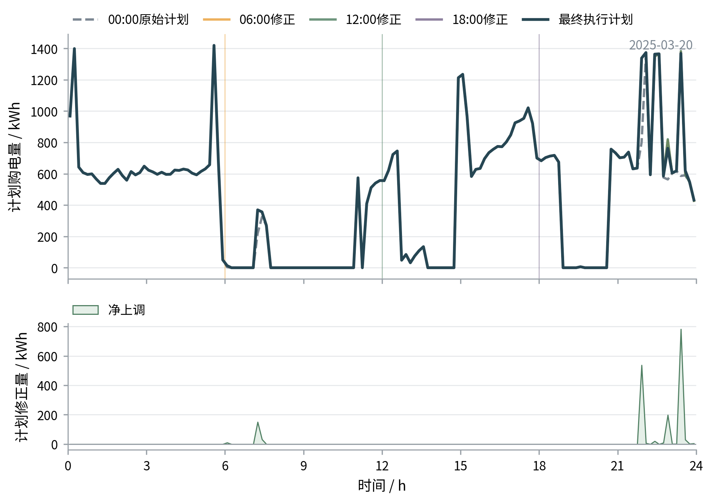
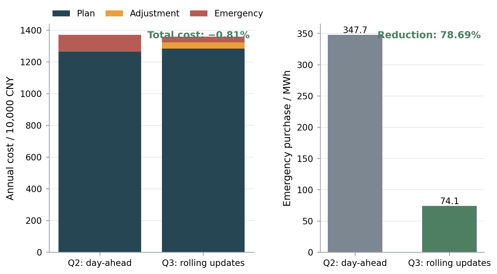

# 五、模型建立与求解

## 5.3 问题三模型的建立与求解

问题三引入0、6、12、18时发布的光伏预报：0时形成原计划，其余时刻只修改未执行时段；上调按1.5倍电价结算，下调需支付原计划金额50%的违约费。本问据此权衡净调整费用与5倍价格的紧急购电风险。

### 5.3.1 多时次预报更新与调整结算

记发布时刻集合为

$$
\mathcal H=\{0,6,12,18\}.
$$

在 $h\in\mathcal H$ 时，附件3给出未来24个整点的光伏预报。本文以前一已观测点为锚进行分段线性插值，并换算为kWh/格。定义
$$
\mathcal T_h=\{t:\text{第 }t\text{ 格的起始时刻不早于 }h\},
$$
并将时刻 $h$ 发布信息得到的光伏预测记为 $\hat p_{t\mid h}$。该预测只能用于 $t\in\mathcal T_h$ 的尚未执行时段；负载预测仍沿用问题二中按变量选择的严格因果模型。场景构造也只抽取日期 $d$ 以前、且与发布时刻 $h$ 对齐的历史源荷残差。

图6给出信息更新顺序：0时形成原计划；6、12、18时锁定已执行区间，以当前SOC重建场景并优化剩余时段，随后只执行至下一节点。

图6 问题三多时次预报更新与滚动决策机制

令 $G_t^0$ 为0时制定的原计划购电量，$G_{t\mid h}^{a}$ 为时刻 $h$ 对剩余时段给出的调整后购电量。相对于原计划的上调量和下调量分别定义为

$$

\begin{cases}
U_t^h=\max\{G_{t\mid h}^{a}-G_t^0,0\},\\
V_t^h=\max\{G_t^0-G_{t\mid h}^{a},0\}.
\end{cases}

$$

为保持模型线性，将其写成

$$

\begin{cases}
G_{t\mid h}^{a}-U_t^h+V_t^h=G_t^0,\\
U_t^h,V_t^h\ge0.
\end{cases}

$$

0时原计划费用属于已经确定的支出；调整阶段只需权衡上下调费用和可能发生的紧急购电费用。一天结束后，以最后一次有效修正形成的执行计划 $G_t^a$ 统一结算，日总费用为

$$
J_3=\sum_{t=1}^{144}\pi_tG_t^0
+1.5\sum_{t=1}^{144}\pi_tU_t
-0.5\sum_{t=1}^{144}\pi_tV_t
+5\sum_{t=1}^{144}\pi_tG_t^e.
$$

该费用口径把原计划、上调、取消原计划金额、下调违约费、下调净费用和紧急购电分开核算，避免用调整后的总购电量替代原计划计费。新结算规则下，下调可以降低净费用，因而必须显式保留 $V_t^h$ 及其取消金额，不能再推出全年下调费用为零。

### 5.3.2 分段滚动购电模型

0时阶段沿用问题二的48 h、40场景滚动模型，只执行前24 h原计划；6、12、18时分别优化当日剩余108、72和36个10 min时段，并在24时施加SOC参考带，而不继续向后滚动48 h。已执行区间保持锁定，当前实际SOC作为新初值。该处理属于日前计划与日内信息修正相结合的多时间尺度滚动优化[6-9]。

在更新时刻 $h$，调整购电量在各场景中保持一致，储能动作和紧急购电作为场景补救变量。对 $t\in\mathcal T_h$，核心关系为

$$
\begin{cases}
G_{t\mid h}^{a}+G_{t,\omega}^{e,h}+D_{t,\omega}^{h}+R_{t,\omega}^{h}
=\ell_{t,\omega}^{h}+C_{t,\omega}^{h}+W_{t,\omega}^{g,h},\\
R_{t,\omega}^{h}+W_{t,\omega}^{pv,h}=p_{t,\omega}^{h},\\
S_{t+1,\omega}^{h}
=S_{t,\omega}^{h}+\eta_cC_{t,\omega}^{h}
-\frac{D_{t,\omega}^{h}}{\eta_d}.
\end{cases}
$$

储能容量、充放电上限和非负约束沿用问题二，末端满足 $5400\le S_{145,\omega}^{h}\le6600$。调整阶段场景费用为

$$
J_{\omega}^{h}
=\sum_{t\in\mathcal T_h}\pi_t
\left(1.5U_t^h-0.5V_t^h+5G_{t,\omega}^{e,h}\right).
$$

候选目标仍为期望费用与 $\operatorname{CVaR}_{0.9}$ 的加权组合，正式取 $N=40$、$\lambda=0$。每次仅执行至下一节点并传递实际末SOC；执行段采用后验最优补救评价，紧急购电结果可能偏乐观。

### 5.3.3 问题三模型总括

在更新时刻 $h\in\{6,12,18\}$，定义 $k_h=6h+1$ 为该时刻对应的SOC起点索引。令 $\boldsymbol y_h=(G_{t\mid h}^{a},U_t^h,V_t^h)$ 为场景共享的调整变量，$\boldsymbol x_{\omega,h}=(G_{t,\omega}^{e,h},C_{t,\omega}^{h},D_{t,\omega}^{h},R_{t,\omega}^{h},W_{t,\omega}^{pv,h},W_{t,\omega}^{g,h},S_{t,\omega}^{h})$ 为场景补救变量，则剩余时域模型可集中写为

**目标函数**

$$
\min_{\boldsymbol y_h,\{\boldsymbol x_{\omega,h}\},\zeta_h,\{z_{\omega,h}\}}
(1-\lambda)\frac1N\sum_{\omega=1}^{N}J_\omega^h
+\lambda\left[
\zeta_h+\frac1{(1-\alpha)N}\sum_{\omega=1}^{N}z_{\omega,h}
\right].
$$

**调整费用与风险约束**

$$
\begin{cases}
J_\omega^h=\sum_{t\in\mathcal T_h}\pi_t
\left(1.5U_t^h-0.5V_t^h+5G_{t,\omega}^{e,h}\right),\\
z_{\omega,h}\ge J_\omega^h-\zeta_h,\qquad z_{\omega,h}\ge0,\\
G_{t\mid h}^{a}-U_t^h+V_t^h=G_t^0.
\end{cases}
$$

**能量平衡约束**

$$
\begin{cases}
G_{t\mid h}^{a}+G_{t,\omega}^{e,h}+D_{t,\omega}^{h}+R_{t,\omega}^{h}
=\ell_{t,\omega}^{h}+C_{t,\omega}^{h}+W_{t,\omega}^{g,h},\\
R_{t,\omega}^{h}+W_{t,\omega}^{pv,h}=p_{t,\omega}^{h}.
\end{cases}
$$

**储能状态约束**

$$
\begin{cases}
S_{t+1,\omega}^{h}
=S_{t,\omega}^{h}+\eta_cC_{t,\omega}^{h}
-\frac{D_{t,\omega}^{h}}{\eta_d},\\
S_{k_h,\omega}^{h}=S_{k_h}^{\mathrm{act}},\qquad
5400\le S_{145,\omega}^{h}\le6600,\\
1200\le S_{t,\omega}^{h}\le10800.
\end{cases}
$$

**变量边界与计算参数**

$$
\begin{cases}
0\le C_{t,\omega}^{h},D_{t,\omega}^{h}\le833.3333,\\
G_{t\mid h}^{a},U_t^h,V_t^h,G_{t,\omega}^{e,h},
R_{t,\omega}^{h},W_{t,\omega}^{pv,h},W_{t,\omega}^{g,h}\ge0,\\
N=40,\qquad \alpha=0.9,\qquad \lambda=0,\qquad
|\mathcal T_h|\in\{108,72,36\}.
\end{cases}
$$

该方程组把信息更新、上下调结算、储能状态传递和剩余时域边界统一在同一滚动优化问题中。

### 5.3.4 指定日期滚动结果

四日0时计划购电量分别为64275.7055、38019.7774、70533.3882和94068.4284 kWh，计划费用分别为40781.94、21920.61、45008.61和61878.99元。由于本问直接使用附件3的0时光伏预报，原计划与问题二存在差异。

图7给出3月20日的多时次修正过程。每次更新只改变发布时刻之后的计划，最终全天计划购电量由64275.7055 kWh增至66064.2091 kWh。

图7 2025年3月20日多时次购电计划修正过程

图中6、12、18时修正均从对应发布时刻开始，已执行区间保持不变，符合信息可得性约束。为比较四个典型日的调整幅度与费用，表5汇总最终购电量及净调整费用。

表5 指定日期滚动购电结果汇总

| 日期 | 最终购电量/kWh | 净调整费用/元 | 调整情况 |
|---|---:|---:|---|
| 3月20日 | 66064.21 | 1240.64 | 部分时段净上调 |
| 6月21日 | 38019.78 | 0.00 | 未调整 |
| 9月23日 | 70533.39 | 0.00 | 未调整 |
| 12月21日 | 94068.43 | 0.00 | 未调整 |

3月20日部分非指定时段发生净上调，产生净调整费用1240.64元；其余三日未调整。四个指定日期的首末SOC均满足容量边界，各更新段承接上一阶段实际末SOC，且未出现同时充放电。

四日紧急购电量依次为428.0518、0.0006、0.0009和0.0018 kWh，其中仅3月20日存在实质性紧急购电，其余为数值残差级输出；对应总费用分别为43743.17、21920.62、45008.61和61879.00元。完整10 min原计划、调整计划、储能运行和紧急购电结果见 result3.xlsx。

### 5.3.5 年度对比与预报时刻评价

以1月作为因果校准和热启动区间，对2025年2月1日至12月31日共334 d滚动计算。问题三原计划费为13116917.31元，上调费用为422272.85元，取消原计划金额为767445.96元，下调违约费为383722.98元，紧急购电费为402348.80元，总费用为13557815.99元；累计紧急购电量为79045.62 kWh，涉及1963个10 min时段。

相较问题二，问题三总费用减少145966.98元，降幅为1.07%；紧急购电量减少268655.41 kWh，降幅为77.26%；紧急购电时段数下降39.02%。虽然计划与上调支出增加，但5倍价格紧急购电费下降更多，因此实现小幅降费和显著风险压缩。

图8 问题二与问题三年度费用及紧急购电量对比

预测信息应由调度目标而非误差单独评价[11]。高风险日消融中，完整更新使紧急购电量下降28.58%、费用上升0.18%；6时贡献主要改善，12时偶有反弹，18时只在晚间缺口明显时作用较大。因此，更适合在预测误差接近储能余量或进入高风险窗口前触发额外优化。年度降幅还包含跨日SOC路径差异。
