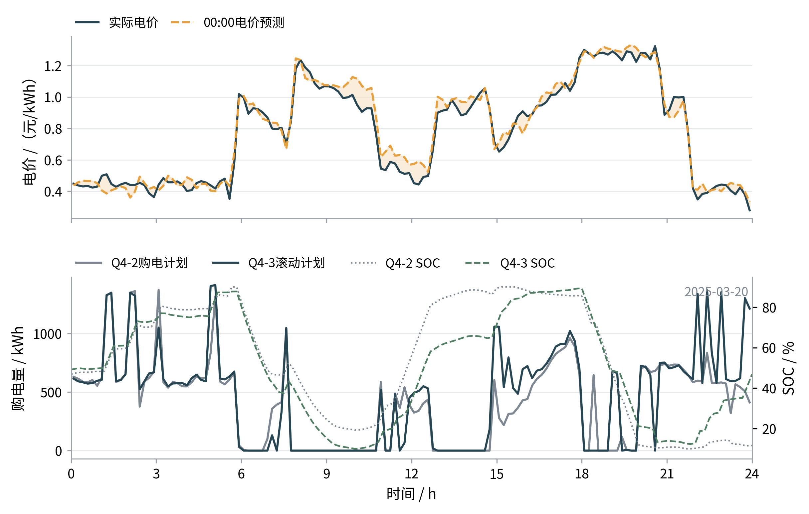
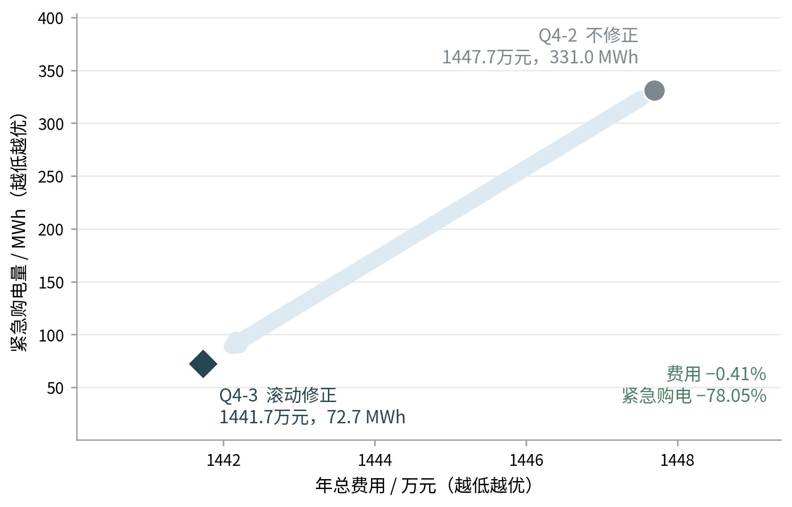

# 五、模型建立与求解

## 5.4 问题四模型的建立与求解

问题四将外网电价由已知曲线扩展为实时波动过程。题目未明确未来实时电价的可见范围；为避免计划阶段提前使用尚未发生的价格，本文把“决策时刻之后的实际电价不可见”设为统一信息边界。每天0时仅利用此前负载、光伏和电价历史预测未来48 h；6时、12时和18时更新时，也只使用已经实现的价格及当时发布的光伏预报。附件4中的未来实际电价不进入计划优化，只在相应时段实现后用于后验结算。在此设定下，分别重算问题二的日前策略（记为问题四-2）和问题三的多时次调整策略（记为问题四-3）。

### 5.4.1 波动电价预测与模型扩展

沿用问题二的扩展窗时间回测，对负载、光伏和价格分别比较季节朴素模型与历史梯度提升模型。1月回测中，负载和价格的季节朴素模型NMAE分别为3.03%和4.53%，光伏的历史梯度提升模型NMAE为7.22%，均低于各自候选模型，因此按变量保留上述组合，而不统一追求更复杂的预测器。

设决策日为 $d$，变量 $x\in\{\ell,p,\pi\}$ 分别表示负载、光伏和电价。以点预测 $\hat{\boldsymbol x}_d$ 为中心，从决策日以前的三变量联合残差中按整日块同步抽样，构造40个源—荷—价场景：

$$
\boldsymbol x_{d,\omega}
=\max\left\{\hat{\boldsymbol x}_d+\boldsymbol\varepsilon_{k(\omega)}^x,0\right\},
\qquad \omega=1,\ldots,40.
$$

同步抽样使同一历史日的负载、光伏和价格残差进入同一场景，保留三者的日内时序及相关波动。问题四-2中，0时计划购电量 $G_t^0$ 对所有场景相同，储能动作和紧急购电量作为场景补救变量。场景费用写为

$$
J_{\omega}^{4-2}
=\sum_t \pi_{t,\omega}
\left(G_t^0+5G_{t,\omega}^{e}\right).
$$

能量平衡、SOC递推、充放电上限和弃光变量均与问题二一致。候选目标仍为期望费用与 $\operatorname{CVaR}_{0.9}$ 的加权组合；正式计算沿用校准结果，取场景数40、风险权重 $\lambda=0$ 和48 h滚动时域，并在第48小时末施加 $6000\pm600\ \mathrm{kWh}$ 的SOC参考带。

问题四-3在0时使用附件3的光伏预报和预测电价形成原计划，并在6时、12时、18时只调整尚未执行的区间。对 $h\in\{6,12,18\}$，记 $\mathcal K_h$ 为当日0时至时刻 $h$ 以前已经实现的10 min时段集合，$n_h=|\mathcal K_h|$。先依据已实现价格计算平均预测偏差

$
b_h=\frac{1}{n_h}\sum_{k\in\mathcal K_h}
\left(\pi_k-\hat\pi_{k\mid0}\right),
$

再将剩余时段的价格预测中心更新为

$
\hat\pi_{t\mid h}=\max\{\hat\pi_{t\mid0}+b_h,0\},
\qquad t\in\mathcal T_h.
$

该修正只利用时刻 $h$ 以前已经实现的价格，不读取未来实测值。结合最新光伏预报重新生成剩余时段场景后，调整阶段的增量费用为

$
J_{\omega,h}^{4-3}
=\sum_{t\in\mathcal T_h}\pi_{t,\omega}
\left(1.5U_t^h+0.5V_t^h+5G_{t,\omega}^{e,h}\right).
$

0时原计划仍采用48 h时域并在第48小时末施加SOC参考带；6、12、18时的调整仅优化当日剩余时段，并在当日24时施加 $6000\pm600\ \mathrm{kWh}$ 的SOC参考带。原计划费单独保留，最终按实际电价对原计划、上调、下调违约和紧急购电四部分结算。已经执行的购电量固定，当前SOC作为下一阶段初值，从而保持日内分段及跨日状态连续。

与问题二、问题三一致，计划及调整严格遵守上述信息边界；但给定实测轨迹下各执行段的储能动作与紧急购电采用完整实测段作后验最优补救求解，并非10 min级因果反馈控制。该实现口径可能使紧急购电结果偏乐观，本文在第七章将其列为主要局限。

### 5.4.2 指定日期结果与价格响应

以2025年3月20日为例，图9同时给出0时价格预测与实际波动，以及问题四-2日前计划、问题四-3最终滚动计划和SOC轨迹。0时预测能够描述价格的大体日内水平，但无法预知全部局部尖峰；问题四-3在新光伏信息和已实现价格偏差到达后，重新配置尚未执行时段的购电量，使调度对价格变化作出因果响应。

图9 2025年3月20日波动电价预测与购电策略响应

四个指定日期的费用与紧急购电结果见表10。3月20日和9月23日，问题四-3分别支付2409.88元和2072.27元上调费用，将紧急购电量从2457.0198 kWh和1904.2714 kWh压缩到0.0010 kWh和0.0011 kWh；但两日总费用分别增加688.69元和964.30元。6月21日问题四-3总费用下降820.54元，12月21日则增加1006.82元，说明滚动策略的日度价值取决于预测偏差、实时价格和期初SOC的共同作用。

表10 波动电价下指定日期问题四-2与问题四-3结果

| 日期 | 问题四-2总费用/元 | 问题四-2紧急购电量/kWh | 问题四-3调整费用/元 | 问题四-3紧急购电量/kWh | 问题四-3总费用/元 |
|---|---:|---:|---:|---:|---:|
| 2025-03-20 | 44189.64 | 2457.0198 | 2409.88 | 0.0010 | 44878.33 |
| 2025-06-21 | 19191.03 | 0.0005 | 0.00 | 0.0006 | 18370.49 |
| 2025-09-23 | 46913.20 | 1904.2714 | 2072.27 | 0.0011 | 47877.51 |
| 2025-12-21 | 70407.08 | 0.0036 | 0.00 | 0.0019 | 71413.91 |

注：问题四-3调整费用为上调费与下调违约费之和；表中紧急购电量保留程序原始输出，未设置归零阈值。

四个日期的完整10 min计划、调整、储能运行和紧急购电明细均已纳入年度结果。全部334 d结果分别写入 result4-2.xlsx 和 result4-3.xlsx，正文只保留具有代表性的费用—风险汇总。

### 5.4.3 年度对比与风险分析

以2025年2月1日至12月31日共334 d为统一统计区间，问题四-2与问题四-3的年度结果见表11。问题四-3增加35173.35元计划费和606305.40元调整费，但紧急购电费减少701143.61元，最终总费用减少59664.86元；累计紧急购电量减少258359.71 kWh。

表11 波动电价下问题四-2与问题四-3年度结果对比

| 指标 | 问题四-2 | 问题四-3 | 问题四-3相对变化 |
|---|---:|---:|---:|
| 计划购电费/元 | 13396823.49 | 13431996.84 | +0.26% |
| 调整费用/元 | 0.00 | 606305.40 | 新增 |
| 紧急购电费/元 | 1080146.78 | 379003.17 | -64.91% |
| 总费用/元 | 14476970.27 | 14417305.41 | -59664.86（-0.41%） |
| 紧急购电量/kWh | 331020.23 | 72660.52 | -258359.71（-78.05%） |
| 紧急购电时段数/格 | 2594 | 1719 | -33.73% |
| 日费用P95/元 | 72549.46 | 72851.05 | +0.42% |

图10将总费用和紧急购电量放在同一成本—风险平面中。问题四-3只带来0.41%的平均费用改善，却使紧急购电量下降78.05%，表明其主要贡献是以可控的计划与调整支出替代5倍价格的被动补救，而不是显著降低全部购电支出。

图10 波动电价下问题四-2与问题四-3成本—风险对比

需要注意，问题四-3的日费用P95由72549.46元升至72851.05元，增幅0.42%。因此，多时次调整并未在所有指标上占优，而是在年度平均成本、尾部费用与供电缺口之间重新分配风险。模型检验还表明，高风险日的完整更新平均使紧急购电下降13.93%，但费用上升3.49%，进一步说明单次更新不保证费用单调下降。

由于问题四使用未知波动电价，而问题二和问题三采用固定已知电价，二者的信息集和结算曲线不同，不能将跨问题金额差直接解释为模型优劣。公平结论应限定在问题四-2与问题四-3之间：在相同波动电价信息边界下，多时次滚动策略以不足1%的总费用变化显著压缩紧急购电暴露，并保持全部能量与SOC约束可行。