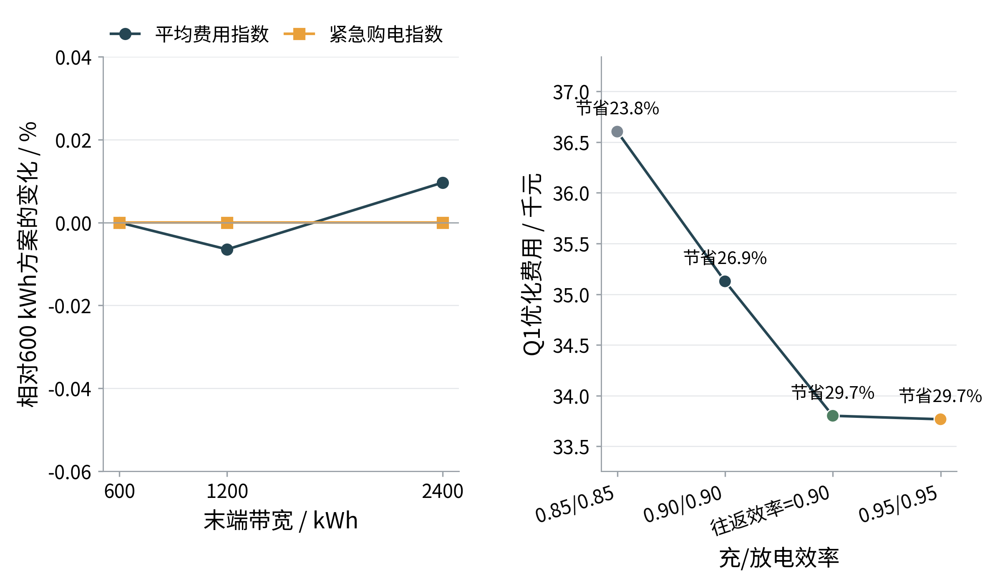

# 六、模型检验

本文各问题均建立在统一的10分钟能量平衡、储能状态转移和购电结算口径上。模型检验从物理约束、费用复算、预测器选择、场景收敛、风险权衡、参数敏感性和滚动更新消融七个方面展开。

## 6.1 检验指标与判定标准

预测误差采用归一化平均绝对误差

$$
\operatorname{NMAE}=\frac{n^{-1}\sum_{t=1}^{n}|\hat y_t-y_t|}{n^{-1}\sum_{t=1}^{n}|y_t|}.
$$

能量平衡残差和SOC状态残差分别定义为

$$
r_t^{\mathrm{bal}}=G_t+G_t^e+D_t+R_t-\ell_t-C_t-W_t^g,
$$

$$
r_t^{\mathrm{soc}}=S_{t+1}-S_t-\eta_cC_t+D_t/\eta_d.
$$

所有物理检验以最大绝对残差不超过$10^{-5}$ kWh为通过标准；场景收敛要求40与60场景的平均日成本差小于2%、紧急购电差小于10%。

## 6.2 物理可行性与费用复算

表6汇总了正式方案的独立复算结果。

表6 物理约束与费用复算结果

| 方案 | 最大平衡残差/kWh | 最大状态残差/kWh | SOC范围/kWh | 同时充放电格数 | 费用复算差/元 |
|---|---:|---:|---:|---:|---:|
| Q2 | $4.55\times10^{-13}$ | $4.55\times10^{-12}$ | 1200–10800 | 0 | 0 |
| Q3 | $6.82\times10^{-13}$ | $4.66\times10^{-12}$ | 1200–10800 | 0 | $1.86\times10^{-9}$ |
| Q4-2 | $5.68\times10^{-13}$ | $4.55\times10^{-12}$ | 1200–10800 | 0 | $1.86\times10^{-9}$ |
| Q4-3 | $6.82\times10^{-13}$ | $4.55\times10^{-12}$ | 1200–10800 | 0 | $1.86\times10^{-9}$ |

各方案均满足能量平衡、SOC递推、充放电上限和首末状态要求。独立复算严格按“计划量计计划费、调整量计调整费、紧急量按5倍电价计费”，没有用实际消耗量替代计划计费。最大单格充放电量为833.3333 kWh，对应5000 kW功率上限乘以$1/6$小时。由此可判定模型输出在数值精度内物理可行、会计口径闭合。

## 6.3 预测选择与场景收敛

扩展窗回测结果显示，负载、光伏和价格最终采用模型的NMAE分别为3.03%、7.22%和4.53%。其中HistGBR只在光伏预测上优于季节朴素法，负载和价格保留简单基线。因此，模型选择体现为按变量选择预测器，而不是以模型复杂度代替样本外证据。

在场景数检验中，40相对60场景的平均日成本差为0.32%，紧急购电差为2.49%，均低于预设阈值。40场景因此成为精度与计算成本之间的折中。图11左侧给出场景数量变化下的费用和紧急购电指数。

图11 参数校准与场景收敛结果

## 6.4 CVaR风险价格与末端SOC敏感性

在20场景、末端半宽600 kWh的校准网格中，CVaR权重由0升至0.1时，紧急购电量下降78.31%，但平均成本上升5.85%；权重0.25和0.5几乎消除紧急购电，却分别使平均成本上升22.07%和33.22%。这说明风险厌恶具有明确价格，正式年度方案按样本外实际费用规则选择风险权重0，并不意味着CVaR无效。

末端半宽取600、1200和2400 kWh时，四季代表日平均成本分别为43541.44、43538.61和43545.63元，最大相对差仅0.016%，紧急购电量基本不变。因此结果对带宽数值稳定；但末端参考带在校准日频繁成为活跃约束，不能据此宣称终端条件完全不起作用。

## 6.5 储能效率与极端误差检验

储能效率敏感性结果见图12。双向效率由0.85/0.85提高至0.95/0.95时，Q1成本由36603.41元降至33767.03元，节省率由23.83%升至29.73%。在固定计划压力测试中，效率降低使平均成本上升9.99%、紧急购电增加132.43%；效率提高使平均成本下降4.68%、紧急购电下降74.83%，方向符合储能损耗机理。

图12 末端SOC带宽与储能效率敏感性

净需求按$-20\%$至$+20\%$扰动时，四季平均成本从40125.74元升至84705.10元，紧急购电量从接近0升至48015.15 kWh。净需求高于计划时，成本和紧急购电单调增加；低于计划时，模型通过弃光或未使用计划电量保持可行。该结果验证了不等式供需约束和显式松弛变量的实现。

## 6.6 滚动更新消融

在各季度高风险日上，从仅使用0时计划到完整更新，Q3紧急购电下降28.58%、平均费用上升0.18%；Q4紧急购电下降13.93%、平均费用上升3.49%。6时更新贡献了大部分风险下降，12时在部分日期出现反弹，18时的边际改善较小。因此不能宣称每增加一次更新都严格改善，只能表述为完整滚动策略总体降低紧急购电暴露。

图13 滚动更新消融结果

全年Q3和Q4-3的紧急购电量分别下降78.69%和78.05%，降幅大于单日消融结果，说明年度收益还包含不同策略形成的跨日SOC路径效应，而非某一次更新的单独贡献。

## 6.7 总体判定与边界

模型在物理可行性、费用口径、预测选择、场景收敛、参数方向和极端误差检验下均通过。滚动更新对降低紧急购电风险的作用得到年度对比和高风险日消融共同支持，但日内更新并非单调改进，短期内可能增加费用。上述结论仅适用于题目给定数据、场景、参数和信息边界；风险权重、末端参考带和高风险日消融的限制将在下一章进一步讨论。
