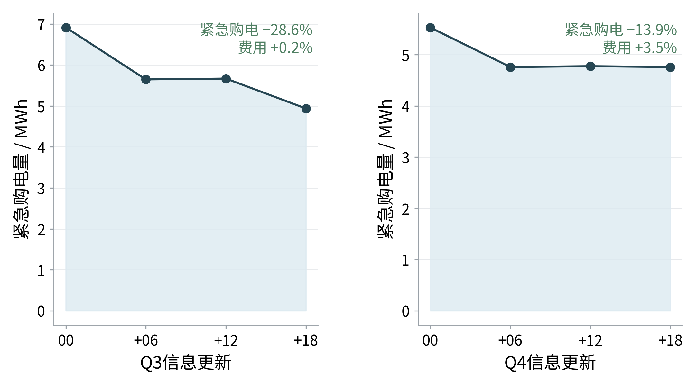

# 六、模型检验

本文从约束闭合、预测与场景稳定性、关键参数敏感性和滚动更新消融四个方面检验模型。检验对象与正文采用相同的数据处理、计划信息边界和费用口径；各项结果汇总于表12，随后只保留两幅直接支撑核心结论的图，储能物理参数的完整敏感性图移至附录。

## 6.1 检验指标与总体结果

预测误差采用归一化平均绝对误差

$$
\operatorname{NMAE}
=\frac{n^{-1}\sum_{t=1}^{n}|\hat y_t-y_t|}
{n^{-1}\sum_{t=1}^{n}|y_t|}.
$$

能量平衡残差与SOC状态残差分别定义为

$$
r_t^{\mathrm{bal}}
=G_t+G_t^e+D_t+R_t-\ell_t-C_t-W_t^g,
$$

$$
r_t^{\mathrm{soc}}
=S_{t+1}-S_t-\eta_cC_t+D_t/\eta_d.
$$

物理约束以最大绝对残差不超过 $10^{-5}$ kWh为通过标准。除直接检查约束外，本文还复算费用分项，并对预测器、场景数、风险权重、末端SOC带宽、储能效率、净需求扰动和更新时刻进行对照检验。

表12 模型检验与敏感性分析汇总

| 编号 | 检验内容 | 关键结果 | 结论 |
|---|---|---|---|
| V1 | 物理与会计闭合 | 最大能量平衡残差 $6.82\times10^{-13}$ kWh，最大状态残差 $4.66\times10^{-12}$ kWh，费用复算差不超过 $1.86\times10^{-9}$ 元；SOC为1200～10800 kWh，同时充放电格数为0 | 通过 |
| V2 | 预测器样本外选择 | 负载、光伏和价格最终模型NMAE分别为3.03%、7.22%和4.53% | 按样本外误差选模 |
| V3 | 场景数收敛 | 40场景相对60场景的平均日费用差0.32%，紧急购电量差2.49% | 40场景可用 |
| V4 | 风险权重 | $\lambda=0.1$ 时紧急购电下降78.31%、费用上升5.85%；$\lambda=0.25,0.5$ 时费用分别上升22.07%、33.22% | 风险降低有明确代价 |
| V5 | 末端SOC带宽 | 半宽600、1200、2400 kWh时，四季代表日平均费用为43541.44、43538.61、43545.63元，最大相对差0.016% | 对带宽扰动稳定 |
| V6 | 储能效率 | 双向效率0.85、0.90、0.95时，问题一节省率分别为23.83%、26.90%、29.73% | 主结论不反转 |
| V7 | 净需求扰动 | 扰动由 $-20\%$ 增至 $+20\%$ 时费用与紧急购电总体上升；$+20\%$ 时紧急购电量为48015.15 kWh，全部情景可行 | 方向符合机理 |
| V8 | 更新时刻消融 | 高风险日完整更新使问题三、问题四紧急购电分别下降28.58%、13.93%，费用分别变化 $+0.18\%$、$+3.49\%$ | 风险改善有条件通过 |

## 6.2 场景、风险与参数敏感性

扩展窗回测表明，HistGBR仅在光伏预测上优于季节朴素法，负载和价格保留简单基线，说明预测器由样本外误差而非模型复杂度决定。场景数由40增至60后，平均日费用和紧急购电量的变化均较小，故正式模型采用40场景，在稳定性与计算量之间取得折中。

图11 参数校准与场景收敛结果

图11同时显示风险权重带来的成本—风险权衡。在20场景、末端半宽600 kWh的校准网格中，$\lambda$ 由0增至0.1后，紧急购电量下降78.31%，但平均费用上升5.85%；当 $\lambda=0.25$ 和0.5时，紧急购电几乎消失，费用却分别上升22.07%和33.22%。因此，正式方案按样本外实际费用选择 $\lambda=0$，并不意味着风险项无效，而是表明样本期内继续压缩缺口需要支付较高保守成本。

末端SOC半宽从600 kWh扩大至2400 kWh时，代表日费用最大相对差仅0.016%，紧急购电基本不变；但末端约束在校准日曾达到边界，故这里只能说明结果对带宽扰动稳定，不能据此删去末端价值约束。双向效率由0.85提高至0.95时，问题一费用由36603.41元降至33767.03元，符合损耗下降的物理机理；若将问题一基准计划固定后再复算，0.85效率使费用增加9.99%、紧急购电增加132.43%，0.95效率则使费用下降4.68%、紧急购电下降74.83%。相关完整图列入附录，避免正文图表在章末集中堆叠。

## 6.3 滚动更新消融与适用边界

在四季高风险日上依次加入6时、12时和18时更新，得到图12。由仅使用0时计划改为完整更新后，问题三紧急购电量下降28.58%、平均费用上升0.18%；问题四紧急购电量下降13.93%、平均费用上升3.49%。6时更新贡献了主要风险下降，12时在部分日期出现反弹，18时只在特定晚间缺口明显时带来较大改善。

图12 滚动更新消融结果

因此，模型能够支持“完整滚动策略总体降低紧急购电暴露”，但不能推出每次更新都会使费用或缺口单调下降。全年问题三和问题四-3的紧急购电量分别下降78.69%和78.05%，降幅大于高风险日消融结果，说明年度差异还包含不同策略形成的跨日SOC路径效应。

综合来看，模型通过了物理约束、会计复算、预测选择、场景收敛、参数方向和极端净需求扰动检验；滚动更新则按成本—风险权衡有条件通过。上述结论只适用于题目给定的数据、参数、结算规则和本文设定的信息边界。计划生成与修正遵守无前视原则，但实测执行段采用后验最优补救求解，其适用限制在第七章进一步讨论。
